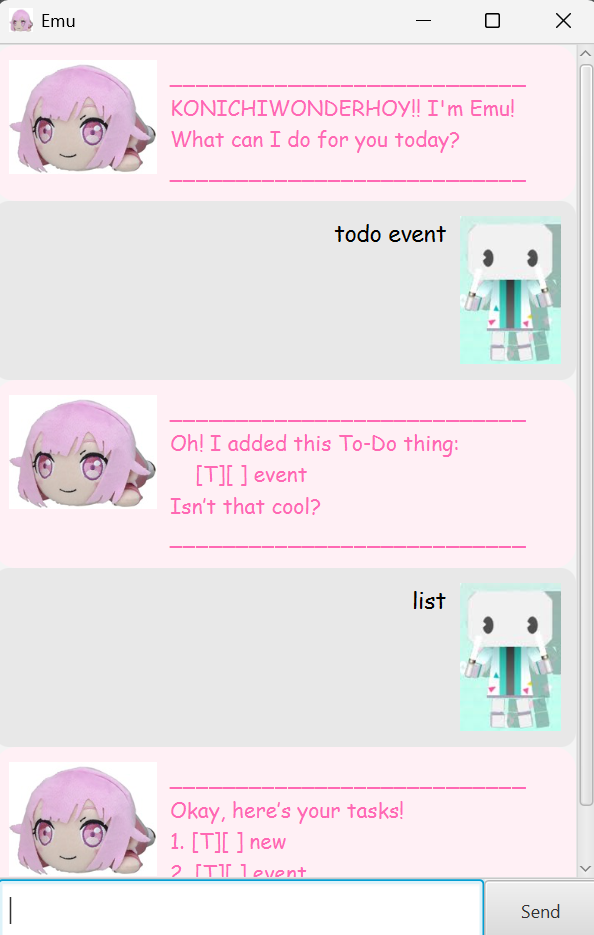

# Emu User Guide

**Emu** is a **desktop smart task management chatbot** that helps
you capture, organize, and track tasks efficiently, with a cheerful personality to boot!

## Features
> **Notes about the command format:**
>
> - Words in `UPPER_CASE` are values given by the user.
>   e.g. in `todo DESCRIPTION`, `DESCRIPTION` is a value given by the user.
>
> - Formats must be followed in the <ins>exact</ins> order given.
>
> - Extra values given for commands that do not require any
    (such as `list`, `undo`, and `bye`) will be ignored.
    e.g. `bye 123` will be interpreted as `bye`.
>
> - `INDEX` refers to the index of a task when `list` is used.

### 1. Add a Task
Emu supports three types of tasks:

- ### **To-Do Task**
  - A task with only a `DESCRIPTION`.

  - **Format:** `todo DESCRIPTION`   
  - **Example:** `todo Buy groceries`

- ### **Deadline Task**
  - A task with a `DESCRIPTION` and a `BY` date.
  - `BY` can be **any string**  — if in `YYYY-MM-DD` format,
    it will automatically be converted to `MMM d yyyy`.

  - **Format:** `deadline DESCRIPTION /by BY`
  - **Example:** `deadline Submit report /by 2026-02-28`

- ### **Event Task** 
  - A task with a `DESCRIPTION`, a `FROM` date and a `TO` date.
  - `FROM` and `TO` can be **any string**  — if in `YYYY-MM-DD` format,
    it will automatically be converted to `MMM d yyyy`.

  - **Format:** `event DESCRIPTION /from FROM /to TO`
  - **Example:** `event Meeting /from 2026-02-21 /to 2026-02-21`

    > **Note:** Emu does not ensure the event `FROM` date
    is before the `TO` date.

### 2. Mark a Task
Marks a task as done.

- **Format:** `mark INDEX`
- **Example:** `mark 2`

### 3. Unmark a Task
Unmarks a previously marked task.

- **Format:** `unmark INDEX`
- **Example:** `unmark 2`

### 4. Delete a Task
Deletes a task from the TaskList.

- **Format:** `delete INDEX`
- **Example:** `delete 3`

### 5. Undo Last Change
Undoes the last action that modified the TaskList.

- **Format:** `undo`

> **NOTE**: Only actions that modify the TaskList (add, delete, mark/unmark) can be undone.

### 6. List All Tasks
Displays all tasks in the TaskList.

- **Format:** `list`

### 7. Search Tasks by Keyword
Searches for tasks whose description contains the given `KEYWORD`.

- **Format:** `find KEYWORD`
- **Case-sensitive**, returns tasks in the order they appear in the list.
- **Example:** `find homework`

> **NOTE**: If nothing / whitespace is given for `KEYWORD`, `find` will return all tasks

### 8. Quit and Save
Saves all tasks and exits the program.

- **Format:** `bye`

> **Note:** Do not close the chatbot via the X button — tasks will **not** be saved.

### 9. Data Handling
- Tasks are automatically loaded from `[JAR location]/data/tasks.txt`.
- Advanced users can edit this file **only when Emu is not running**.
- Invalid edits may be discarded, or corrupt the original data. Do it
  at your **own discretion**.

## Command Summary

| Action        | Command Example                        |
|---------------|----------------------------------------|
| Add To-Do     | `todo DESCRIPTION`                     |
| Add Deadline  | `deadline DESCRIPTION /by BY`          |
| Add Event     | `event DESCRIPTION /from FROM /to TO`  |
| Delete        | `delete INDEX`                         |
| Mark Task     | `mark INDEX`                           |
| Unmark Task   | `unmark INDEX`                         |
| Undo          | `undo`                                 |
| List Tasks    | `list`                                 |
| Search        | `find KEYWORD`                         |
| Quit & Save   | `bye`                                  |